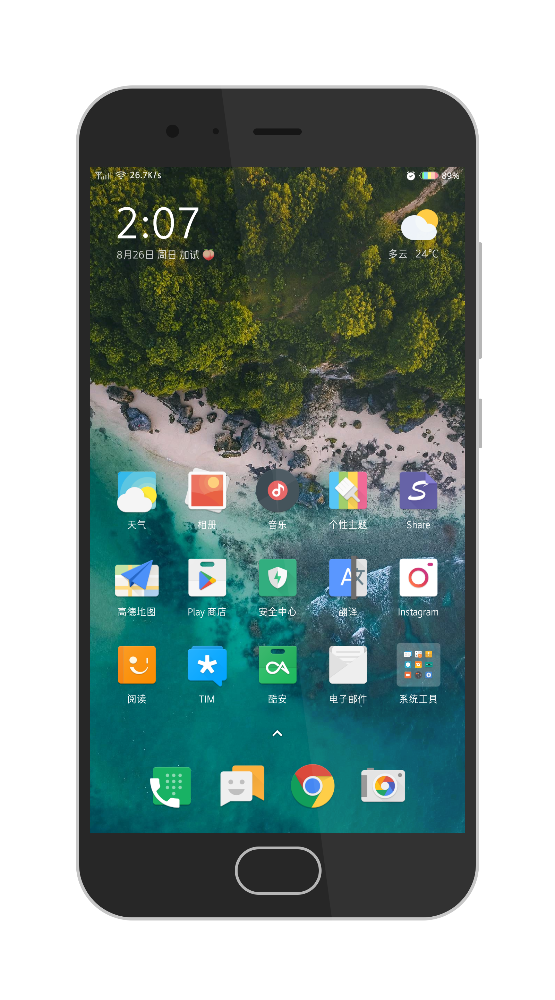
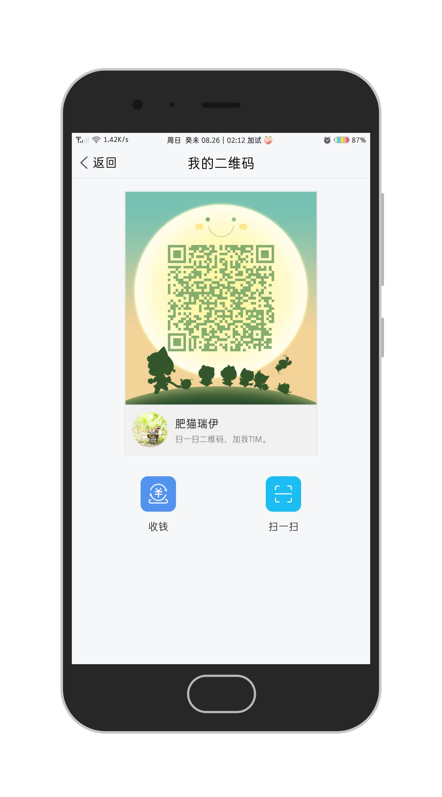

# MI6_Optimization
MI6调教指南

# 前言
不少同学觉得官方miui自定义不够强，纷纷刷官改和类原生。当然不少人喜欢原生系统，它纯净省电、可玩性极强，同时资源丰富，诸如` Xposed `等神器支持良好。不过，缺点也很明显，像 ***NFC*** 这些功能基本残废。bug还是有一些的，不影响日用。由于我对云服务很强依赖，需要一个稳定省电的系统。所以本指南将以最新官方稳定系统为基础进行调教。除了安装第三方recovery以外，不会改动系统分区，从而最大程度保证系统的稳定和省电

---
---

> ***一个稳定的系统可以极大的提高学习的效率***
>> ---- ***鲁迅***

> ~~~帮我压好鲁迅的棺材盖😳🤪~~~


  

--- 

   

--- 


---
---

<table>
<tr>
   <td></td>
   <td></td>
</tr>
<tr>
   <td></td>
   <td></td>
</tr>
</table>

> 本指南将在官方MIUI的系统基础上对MI 6进行个性化，以达到稳定省电的目的。所以内核方面暂时没有计划。😜


So,不修改系统才能保证原来的稳定，所以这里使用Magisk模块(一部分自制，一部分来自酷友)：

- 什么是` Magisk `：   
Magisk是一款不修改系统文件但是能做到与修改系统相同效果的神器。

[Magisk项目地址](https://github.com/topjohnwu/Magisk)

# 个性化Magisk模块
> 已制做模块以及推荐安装的模块（由于miui10稳定版系统要到9月份左右才出，下面仅以8.8.9开发版制造模块）


- 时间居中模块(miui_center_clocker)
- 系统级屏幕圆角
- MIUI主题（整合安卓7.0开机画面）
- dpi调整
- 全面屏手势（包含禁用系统升级、Google相机代码、dpi修改）
- [mm管理器](https://github.com/Magisk-Modules-Repo/Magisk-Manager-for-Recovery-Mode)（方便recovery下面卸载模块）
- 阿丽达黑字体（来自微信公众号：宁静之雨）
- 杜比音效(来自酷友)
- [ViPER4Android-FX](https://github.com/Magisk-Modules-Repo/ViPER4Android-FX)
- [绿色守护](https://github.com/Magisk-Modules-Repo/Greenify4Magisk)(压制毒瘤)

### 关于谷歌服务
- 方案 1(不推荐，除非你想体验Pixel)：

[MagicGApps](https://github.com/Magisk-Modules-Repo/MagicGApps) + [Open GApps](https://github.com/opengapps/opengapps)

##### 食用方法
1. 前往[Opengapps](https://opengapps.org/)下载符合你当前系统的版本，下载完成后将其复制到内部存储，确保包名为` open_gapps-* zip `
2. 第三方Recovery中安装模块MagicGApps


- 方案 2(推荐)：

使用[GoogleInstaller](https://googleinstaller.org)

## 部分实现
- 启用 ***Google相机*** api，这里需要修改/system/build.prop,我已制造相关模块保证系统稳定，这里只是说明实现，在` /system/build.prop `添加如下代码：

```
persist.camera.HAL3.enabled=1
persist.camera.eis.enable=1
```
- 开启全面屏手势
` /system/build.prop `修改` qemu.hw.mainkeys=1 `为` qemu.hw.mainkeys=0 `

- dpi
可以在` /system/build.prop `修改` ro.sf.lcd_density=480 `，也可以使用命令` wm density dpi_num `(root权限下，且只适用于骁龙处理器)


- 系统级屏幕圆角
在/system/etc/device_features/sagit.xml中添加：

```
<!--whether round corner--> 
<bool name="support_round_corner">true</bool>
```

## 软件生态
> 仅有一个稳定省电的系统是远远不够的，只有配合优质的软件才可以达到最佳效果(可以配合黑域和绿色守护压制部分毒瘤)

- Chrome
- [google相机](https://www.celsoazevedo.com/files/android/google-camera/f/MGC_5.2.022_1.0.apk)
- SSR
- 多看阅读
- Share
- VLC
- Termux
- 一个木函
- Tim
- Gboard
- Facebook
- Youtube
- Telegram
- WPS Office
- Instagram
- 谷歌翻译
- 酷安
- 冰箱
- 时光相册
- 谷歌地图

# 油管视频

   
[](https://www.youtube.com/watch?v=y4oQiD3MoMM)


# 镜像目录

GitHub下载太慢的话，可以前往服务器下载(服务器对某些地区电信网络不太友好)：  

<details><summary>下载</summary><a href="https://file.ourfor.top">目录</a></details>

注意事项：
1. 请确保您已经安装第三方Recovery，以及备份好基带
2. 安装mm管理器，方便卸载Magisk模块
--- 

<details>
   <summary>mm管理器用法</summary>
   
   1.重启进入Recovery，打开  ***Terminal***   
   
   2.执行` cd /data/media `
   
   3.使用` ./mm `来使用mm管理器
   
</details>  

---
--- 

# Contact

<table>
  <tr>
    <td></td>
    <td></td>
    <td></td>
  </tr>
</table>
    
 
